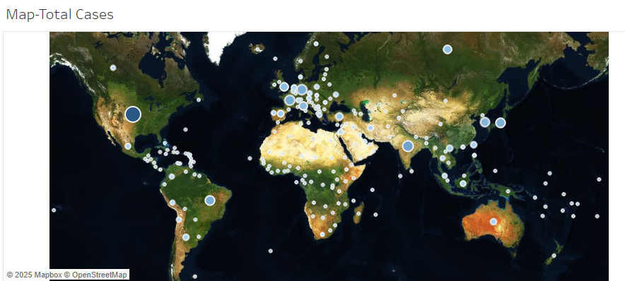
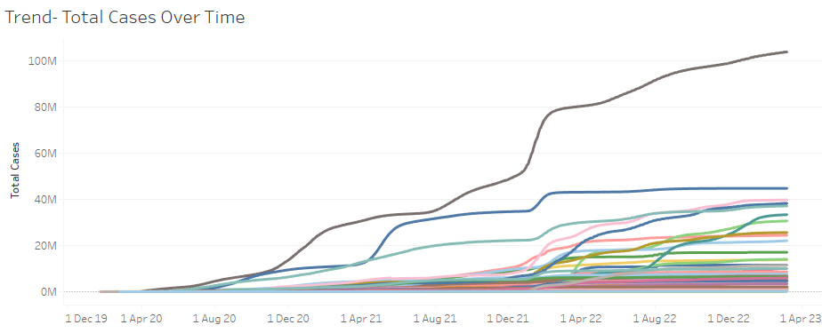

# COVID-19 Global Impact Dashboard

🦠 **Tableau Dashboard visualizing the global spread and impact of COVID-19.**

---

## 📌 Overview

Analyzed global COVID-19 case trends using **Tableau**. Includes country-wise case counts, trend lines, and map visualizations to understand how the pandemic evolved across regions.

---

## ✅ Key Highlights

- Total confirmed cases by country & continent  
- Daily & cumulative trends over time  
- Correlation with basic economic indicators  
- Interactive map & time filters

---

## 🛠️ Tools Used

- **Tableau Desktop** — interactive visualizations  
- **Excel** — data cleaning

---

## 📈 Screenshots

| Global Map | Trends Over Time |
|---|---|
|  |  |

---

## 📂 How to Use

Open `COVID19-Dashboard.twbx` in **Tableau Public** or Desktop.  
**Data Source:** [Johns Hopkins COVID-19 Dataset](https://github.com/CSSEGISandData/COVID-19)

---

## 🔍 Insights

- Identified peak periods for major countries.
- Visualized spread geographically.
- Showed correlation between region & impact.

---

## 👤 Author

Aaryan  
[LinkedIn](https://linkedin.com/in/anarray) | [GitHub](https://github.com/An-Array)
